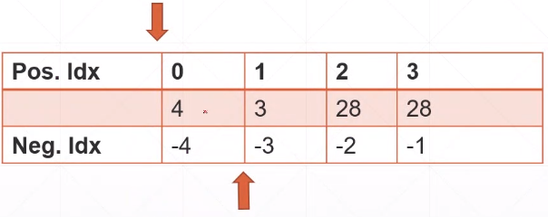
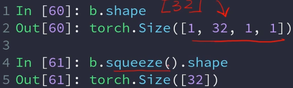

# Tensor切片

```python
a = torch.randn(4,1,28,28)
```

- View和reshape

a.view和a.reshape的作用是一样，都是将张量的大小进行改变

例如：

```python
a = a.view(4,28*28)
print(a.shape)
#输出 torch.size([4,784])
```

<font color="red">**注：一定要保证总的大小是不变的，也就是numel()不变，否则会造成数据的丢失**</font>


- squeeze和unsqeeze

**unsqeeze就是一个维度增加的操作**

a.unsqueeze(0)表示在在第0个维度之前添加一个维度

a.unsqueeze(4)表示在第4个维度之前添加一个维度

> 传递的参数就是指在第n个维度之前添加一个维度，这个参数也可以是负数，表示从倒数第n个之后添加一个维度。



同理

squeeze是一个维度删除的操作

基本用法相同


squeeze不传给任何参数的时候是会把能删除的都删除了，比如有1的

